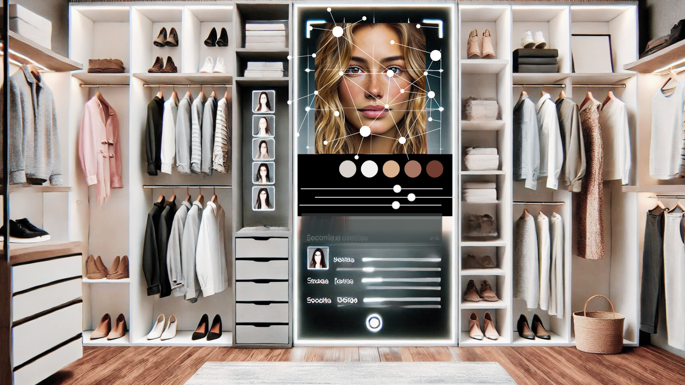

# MATCH MAKER: *Smart Search, Smart Style*

### Revolutionizing Fashion with AI

In the realm of fashion, there exists a profound gap: the absence of sophisticated AI to personalize and transform the shopping experience. **MATCH MAKER** is set to revolutionize the industry by harnessing the power of **Large Language Models (LLMs)** to simplify the search process on retailers websites and allow consumers to find the ideal outfit for the event they are attending.





## Table of Contents
- [Business-Model](#business-model)
- [Technology Stack](#technology-stack)
- [Usage](#usage)


## Business-Model

### Why do end consumers use Match Maker?

- **Personalized Shopping Experience:** Match Maker uses Claude v3-5 to provide outfit recommendations tailored to individual style preferences, body type, and specific occasions, significantly reducing browsing time.
- **Virtual Stylist:** Users can simply upload a photo to receive expert styling advice, bypassing the need for in-person consultations and shopping trips.
- **Enhanced Confidence:** Personalized recommendations boost user confidence in their fashion choices, knowing they are curated by advanced AI.

### How do Retailers benefit from Match Maker?

- **Increased Customer Satisfaction:** By delivering highly personalized recommendations, CLOSET enhances customer loyalty and satisfaction.
- **Operational Efficiency:** Reducing the need for 1) physical stores and 2) staff cuts down on operational costs and 3) streamlines the shopping process.
- **Market Differentiation:** Leveraging cutting-edge AI technology sets companies apart in a competitive market, attracting tech-savvy consumers.
- **Boost in Online Sales:** Precision in suggestions leads to higher conversion rates and larger purchase volumes.
- **Reduction in Returns:** Accurate fit and style recommendations decrease the likelihood of product returns, saving logistical costs.


## Technology Stack

### Anthropic API - claude v3-5 
**Anthropic API** integrates advanced natural language processing capabilities to:
- **Process User Input:** Analyze user descriptions, preferences, and needs.
- **Vision** Recognize hex colors from user-uploaded images. This helps in the Seasonal Palette Identification.
- **Generate Recommendations:** Combine user input with encoded images to provide personalized outfit suggestions.

### Streamlit
**Streamlit** powers the web interface of **MATCH MAKER (CLOSET)**, providing an intuitive and interactive platform for users to upload images, input details, and receive real-time fashion recommendations.

### Python
**Python** is the core programming language for **CLOSET**, chosen for its simplicity, extensive libraries, and robust community support. In `app.py`, Python is used for:
- **API Integration:** Manage and process data from user-provided or default APIs.
- **Image Processing:** Utilize libraries such as `PIL` and `opencv-python` to handle image uploads and preprocessing.
- **Prompt Creation :** We develop prompts that are completed with the user input and outputs from previous prompts
- **Invoking Claude v3-5**: We invoke claude each time we want to generate a response 

```sh
response = client.messages.create(
        model=MODEL_NAME,
        max_tokens=2048,
        messages=message_list)
```
        


## Usage

### Prerequisites
Before using CLOSET, ensure you have the following installed:
- **Python 3.x:** The core programming language used for the application.
- **Required Libraries:** Install the dependencies listed in `requirements.txt` using the command:
    ```sh
    pip install -r requirements.txt
    ```

1. **Set Up Your API**
   - Ensure you have your API key ready. You can either use your own or the provided one for testing. 

2. **Run the Application**
   - Navigate to the project directory and start the Streamlit application:
     ```sh
     streamlit run app.py
     ```

3. **Interact with the Web Interface**
   - **Upload a Picture:** Upload a photo of your face.
   - **Provide Details:** Input the occasion, your age, and other relevant attributes.
   - **Receive Recommendations:** The system will process the input and provide personalized outfit recommendations.


4. **Understanding the Process**
   - **Image Processing:** The uploaded image is processed to extract key features.
   - **Color Recognition:** Claude v3-5 Vision identifies hex colors from the image.
   - **API Interaction:** The Anthropic API processes user input and generates recommendations based on NLP.
   - **Personalized Output:** You receive tailored fashion advice considering your input and extracted features.


