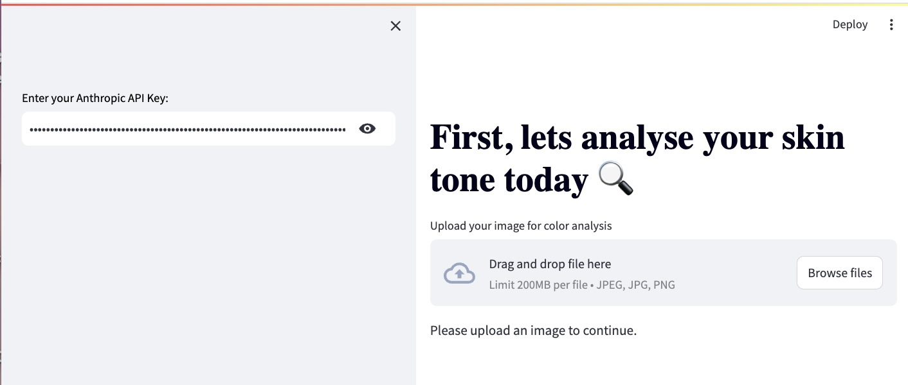

# MATCH MAKER: *Smart Search, Smart Style*

### Making Search Easier with Claude 

In the realm of online fashion, there exists a profound gap: the absence of sophisticated AI to personalize and transform the shopping experience. **MATCH MAKER** is set to revolutionize the industry by harnessing the power of **Large Language Models (LLMs)** to simplify the search process on retailers websites and allow consumers to find the ideal outfit for the event they are attending.


*image generated with DALL·E 3*


## Table of Contents
- [Business-Model](#business-model)
- [Technology Stack](#technology-stack)
- [Usage](#usage)
- [Subfolders Creation](#Subfolder-creation)


## Business-Model

### Why do end consumers use Match Maker?

- **Personalized Shopping Experience:** Match Maker uses Claude v3-5 to provide outfit recommendations tailored to individual style preferences, body type, and specific occasions, significantly reducing browsing time.
- **Virtual Stylist:** Users can simply upload a photo to receive expert styling advice, bypassing the need for in-person consultations and shopping trips.
- **Enhanced Confidence:** Personalized recommendations boost user confidence in their fashion choices, knowing they are curated by advanced AI.

### How do Retailers benefit from Match Maker?

- **Increased Customer Satisfaction:** By delivering highly personalized recommendations, CLOSET enhances customer loyalty and satisfaction.
- **Operational Efficiency:** Reducing the need for 1) physical stores and 2) staff cuts down on operational costs and 3) streamlines the shopping process.
- **Market Differentiation:** Leveraging cutting-edge AI technology sets companies apart in a competitive market, attracting tech-savvy consumers.
- **Boost in Online Sales:** Precision in suggestions leads to higher conversion rates and larger purchase volumes.
- **Reduction in Returns:** Accurate fit and style recommendations decrease the likelihood of product returns, saving logistical costs.


## Technology Stack

### Anthropic API - claude v3-5 (for app.py)
**Anthropic API** integrates advanced natural language processing capabilities to:
- **Process User Input:** Analyze user descriptions, preferences, and needs.
- **Vision** Recognize hex colors from user-uploaded images. This helps in the Seasonal Palette Identification.
- **Generate Recommendations:** Combine user input with encoded images to provide personalized outfit suggestions.

### BLIP Model (for app_categorize.py): 
- It is used to generate the caption of the images  
- **Library Used**: transformers from Hugging Face
- **Models**:
  * **BlipProcessor**: It prepares the image data in a format that the BlipForConditionalGeneration model can understand and processes the model's output into human-readable text. It converts the image into a tensor before the caption is generated and then the same model is used again to convert the output of the BlipForConditionalGeneration model to have a human-readable caption.
  * **BlipForConditionalGeneration**: generates the caption
    ```
    inputs = blip_processor(images=image, return_tensors="pt")
    out = blip_model.generate(**inputs)
    caption = blip_processor.decode(out[0], skip_special_tokens=True)
    ```
  
### CLIP Model (Contrastive Language–Image Pre-training) (for app_categorize.py): 
- It is used for vectorizing the captions generated with the BLIP model -- the vectors capture the meaning of the caption
- **Library Used**: transformers from Hugging Face
- **Models**:
  * **CLIPProcessor**: preprocess the text caption so that it can be correctly input into the CLIPModel
  *  **CLIPModel**: model used for extracting feature embeddings from the processed text 
```
   inputs = clip_processor(text=[caption], return_tensors="pt", padding=True)
    outputs = clip_model.get_text_features(**inputs)
```


### KMeans Clustering(for app_categorize.py): 
- Once we have created the vectors with the clip model, we use the Kmeans algorithm to cluster the vectors representing the captions into distinct groups (in this way, similar images are grouped together)
- **Library Used**: scikit-learn
```
 kmeans = KMeans(n_clusters=num_categories, random_state=0).fit(vectors)
```

### Streamlit (for app.py)
**Streamlit** powers the web interface of **MATCH MAKER (CLOSET)**, providing an intuitive and interactive platform for users to upload images, input details, and receive real-time fashion recommendations.

### Python
**Python** is the core programming language for **CLOSET**, chosen for its simplicity, extensive libraries, and robust community support. In `app.py`, Python is used for:
- **API Integration:** Manage and process data from user-provided or default APIs.
- **Image Processing:** Utilize libraries such as `PIL` and `opencv-python` to handle image uploads and preprocessing.
- **Prompt Creation :** We develop prompts that are completed with the user input and outputs from previous prompts
- **Invoking Claude v3-5**: We invoke claude each time we want to generate a response 

```sh
response = client.messages.create(
        model=MODEL_NAME,
        max_tokens=2048,
        messages=message_list)
```


## Usage of app.py

### Prerequisites
Before using CLOSET, ensure you have the following installed:
- **Python 3.x:** The core programming language used for the application.
- **Required Libraries:** Install the dependencies listed in `requirements.txt` using the command:
    ```sh
    pip install -r requirements.txt
    ```

1. **Set Up Your API**
   - Ensure you have your API key ready. You can either use your own or the provided one for testing.
     
     

2. **Run the Application**
   - Navigate to the project directory and start the Streamlit application:
     ```sh
     streamlit run app.py
     ```

3. **Interact with the Web Interface**
   - **Upload a Picture:** Upload a photo of your face.
   - **Provide Details:** Input the occasion, your age, and other relevant attributes.
   - **Receive Recommendations:** The system will process the input and provide personalized outfit recommendations.


4. **Understanding the Process**
   - **Image Processing:** The uploaded image is processed to extract key features.
   - **Color Recognition:** Claude v3-5 Vision identifies hex colors from the image.
   - **API Interaction:** The Anthropic API processes user input and generates recommendations based on NLP.
   - **Personalized Output:** You receive tailored fashion advice considering your input and extracted features.


## Subfolder-creation

When categorizing images, it will often be the case that the dataset is too large to create subfolders manually. In the file app_categorize.py we provide a solution by clustering the images according to a Kmeans algorithm. 
Here’s a step-by-step description:
 
1. **Images are captioned**: we use the BLIP model to generate a caption of the iamges in the dataset
2. **The captions are vectorized**: we use the CLIP model to vectorize the caption (to capture the main semantic meaning)
3. **Group the actions according to the vectors representing the image captions with KMeans algorithm**:
     ```python
     kmeans = KMeans(n_clusters=num_categories, random_state=0).fit(vectors)
     labels = kmeans.labels_
     ```
4. **Create Subfolders**:
   - For each cluster, create a subfolder named after the cluster label and copy the corresponding images into these subfolders:
     ```python
     for label in range(num_categories):
         subfolder_path = os.path.join(target_folder_path, f"subfolder_{label}")
         os.makedirs(subfolder_path, exist_ok=True)
         for (image_file, caption), image_label in zip(captions, labels):
             if image_label == label:
                 shutil.copy(image_file, subfolder_path)
                 with open(os.path.join(subfolder_path, f"{os.path.basename(image_file)}.txt"), 'w') as f:
                     f.write(caption)
     ```

By following this process, images are organized into subfolders based on their content, making it easier to browse to then run the app.py file which will directly choose the best folder according to its name. 

Feel free to contact me at beatricegiacaloneroca@gmail.com for more information!!

